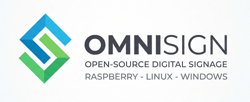
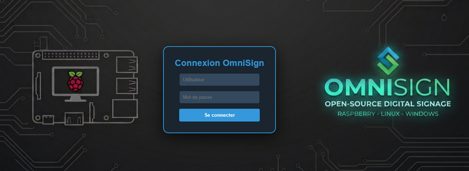

# OmniSign - Dynamic Digital Signage System

<p align="center">
  
</p>
## English

> [!WARNING]
> This project has just been launched and is currently a **Proof of Concept (POC)**. It is **not** intended for production use at this stage.

### Preview
<p align="center">
  <br>
  <em>Secure Login Interface</em><br><br>
  <br>
  <em>Multi-zone Slideshow Editor</em><br><br>
  <br>
  <em>Centralized Media Library Management</em>
</p>

OmniSign is a comprehensive digital signage solution designed to provide centralized management of content for Raspberry Pi-based display units. It consists of a Node.js server for administration and content delivery, and a client-side application for Raspberry Pi devices that handles display and real-time synchronization.

## Features
### Server-side (Node.js)
*   **Web-based Administration Panel:** A user-friendly interface (`admin.html`, `editor.html`, `users.html`, `diaporamas.html`, `media.html`, `sites.html`) for managing all aspects of the digital signage system.
*   **Multi-Site Isolation (Multi-Tenancy):** Group players, playlists, groups, media, and users within isolated "Sites" for clean multi-tenant management. Non-admin users are restricted to their assigned site.
*   **Role-Based Access Enforcement:** Authors are only allowed to modify or delete their own playlists and media files, preventing unauthorized modifications on other files.
*   **Enriched Statistics Dashboard:** A premium visual grid showing online/offline status, playlists/sequences/media counts, and the current active site name, with isolated analytics graphs per site.
*   **Asynchronous YouTube & PPTX Imports:** Non-blocking processing of files. Slides and YouTube downloads run in the background while real-time progress bars (using XMLHttpRequest and WebSockets) keep the user updated.
*   **YouTube Bypass (Cookies):** Bypass YouTube's aggressive bot detection (HTTP 429) by uploading a standard Netscape browser `cookies.txt` file directly in the system settings panel.
*   **Real-time Flash Messaging:** Send instant alerts (info, warning, danger) to specific screens or all devices simultaneously.
*   **Advanced Analytics:** Track media playback frequency and duration with visual charts (Chart.js) and a "Top 50" leaderboard.
*   **Interactive Vignettes Grid:** Beautiful card-based visual layout for screen management showing active device configurations, online/offline colors, and real-time screen captures inside virtual monitor mockup cards.
*   **Remote Device & Power Control:** Take screenshots, adjust volume (system & browser media), force synchronization, clear local cache, send power commands (💡 Wake up, 🌙 Sleep/Standby), restart the system service, or trigger system reboots directly from the admin dashboard.
*   **Periodic Screen Capturing:** Turn on automatic periodic screenshots in the system settings page with custom interval rules to keep vignettes updated automatically.
*   **Group Management:** Organize players by location or category to assign content or trigger actions at scale.
*   **User Management:** Create and manage users with different roles (admin, editor, author) for granular access control. Passwords are securely hashed using bcrypt.
*   **Playlist Management:** Create, edit, and delete dynamic playlists composed of various media types (images, videos).
*   **Media Management:** Upload and organize media files (images, videos, custom fonts) with grid/list view toggles, custom search filter, and sorting.
*   **Player Management:** Register, approve, and assign specific playlists to individual Raspberry Pi display units. Monitor their status (last seen).
*   **Content Scheduling:** Implement time-based scheduling to automatically switch playlists on players at predefined times.
*   **Real-time Updates:** Utilizes Socket.IO to push instant playlist changes and updates to connected Raspberry Pi clients.
*   **Maintenance & Backup:** Built-in ZIP backup and restoration tool for both the SQLite database and media files.
*   **Data Persistence:** Stores all configuration, user data, playlists, and schedules in a SQLite database (`pidyn.sqlite`).
*   **Authentication:** API key-based authentication for Raspberry Pi clients and token-based authentication for the administration panel.
*   **System Logs:** Automated timestamps on all server and client logs for easier troubleshooting.
*   **Standalone Executable:** Capability to package the server as a single `.exe` (Windows) or binary (Linux) using `pkg` for easier distribution.
*   **PPTX Import:** Fully functional import of PowerPoint presentations converting slides into playlist images (requires `LibreOffice` and `pdftocairo` on the server).
*   **YouTube Media Import:** Direct YouTube video downloading and importing to the media library using `yt-dlp`.
*   **Interactive Slideshow Vignettes:** Grid/List view switcher. Grid view features animated thumbnails that cycle through the playlist slides, dynamically rendering the page background, scaled text layers (with custom fonts, alignment, colors), media images, media videos, clocks, and full templates (canteen, meeting status, weather, full-screen video with captions).
### Client-side (Raspberry Pi, Desktop Linux & Windows)
*   **Automated Setup:** Improved `bash` scripts (`setup_pi.sh` for Raspberry Pi Bookworm/Trixie, `setup_linux.sh` for general Linux desktop systems like Linux Mint / Ubuntu), handling automated installations of Node.js, Chromium, audio/capture tools, and graphical configuration.
*   **Universal Desktop session support:** Dynamic user, home directory and authority token lookup in `client_linux` ensuring smooth operation on standard client sessions.
*   **Kiosk Mode:** Advanced Chromium configuration (auto-login, cursor hiding with `unclutter`, hardware acceleration) for a professional full-screen experience.
*   **Automatic Boot:** Automatic configuration of LightDM, Openbox or desktop session autostart launchers to start the player immediately upon login/power-up.
*   **Systemd / User Services:** Sets up `sync-engine.js` as a systemd background service (system-level or user-session level) for automatic operation.
*   **Real-time Playlist Synchronization:** The client player connects to the server via Socket.IO to receive playlist updates.
*   **Enhanced Monitoring:** Reports network status (IP, MAC), WiFi details (SSID, Signal Quality), system audio volume levels, and playback progress to the CMS.
*   **Media Synchronization:** Automatically downloads and caches media files locally from the server, ensuring smooth playback and offline capability.
*   **Configurable:** Reads device-specific configuration (`DEVICE_ID`, `SERVER_URL`, `API_KEY`) from `./setup.txt` (local directory) or `/boot/firmware/setup.txt`.

## Technologies Used
*   **Backend:** Node.js, Express.js, Socket.IO, fs-extra, multer, bcrypt, axios
*   **Frontend:** HTML, CSS, JavaScript (for admin UI)
*   **Client (Raspberry Pi):** Node.js, Socket.IO Client, axios, Chromium, X11, LightDM, Openbox, Systemd, Bash
*   **Database:** SQLite for robust data persistence

## Getting Started
### Easy Server Installation (Windows)
Double-click **`Installer_OmniSign.bat`** at the root of the repository.
The guided wizard will:
1. Check for **Node.js** and automatically install or upgrade it to the latest LTS version using `winget`.
2. Install all required `npm` dependencies.
3. Create an **"OmniSign Serveur"** shortcut on your Desktop.
4. Prompt to launch the server immediately and open your web browser at `http://localhost:3000`.

To start the server manually at any time, double-click `Lancer_OmniSign.bat` or the Desktop shortcut.

### Guided Client Installers (Windows, Raspberry Pi, Linux Desktop)

All 3 client platforms feature an interactive installation wizard that prompts for:
- **Server Address**: Local network IP (e.g., `192.168.1.50:3000`) or Remote Domain URL (e.g., `http://omnisign.local:3000`).
- **Screen API Key**: Generated from the OmniSign server admin panel.
- **Device ID**: Unique identifier for the display unit.

#### 1. Windows Client (`client_win/`)
Run **`Installer_Client_Windows.bat`** inside `client_win/`.
- Interactively configures server URL, API key, and Device ID.
- Automatically generates `setup.txt` and `omnisign-start.bat`.
- Installs Node.js dependencies and optionally registers the player in Windows Startup (`shell:startup`).

#### 2. Raspberry Pi Client (`client_pi/`)
Run **`installer_pi.sh`** inside `client_pi/`:
```bash
cd client_pi
bash installer_pi.sh
```
- Interactive CLI wizard writes setup variables to `/boot/setup.txt` (or `/boot/firmware/setup.txt`).
- Automated system setup (Node.js, Chromium, X11, Openbox, Kiosk autostart, systemd service).

#### 3. Linux Desktop Client (`client_linux/`)
Run **`installer_linux.sh`** inside `client_linux/`:
```bash
cd client_linux
bash installer_linux.sh
```
- Interactive CLI wizard configures `setup.txt`, installs dependencies, and registers autostart entries inside `~/.config/autostart/`.

## Usage
1.  **Access Admin Panel:** Open a web browser and navigate to `http://your-server-ip:3000`.
2.  **Login:** Use the default credentials (e.g., `admin`/`123456`) to log in. **It is highly recommended to change default passwords immediately.**
3.  **Upload Media:** Go to the media section to upload your images and videos.
4.  **Create Playlists:** Design playlists by adding your uploaded media, setting durations, and other properties.
5.  **Manage Players:** Approve new Raspberry Pi clients that connect. Assign playlists to them manually or create schedules.
6.  **Schedule Content:** Define schedules to automatically display different playlists at specific times on your players.

## License
This project is licensed under the MIT License.

# OmniSign - Système d'Affichage Dynamique

<p align="center">
  
</p>
## Français

> [!WARNING]
> Ce projet vient d'être lancé et est actuellement un **Proof of Concept (POC)**. Il ne doit **pas** être utilisé en production pour le moment.

### Aperçu
<p align="center">
  <br>
  <em>Interface de connexion sécurisée</em><br><br>
  <br>
  <em>Éditeur de diaporamas multi-zones</em><br><br>
  <br>
  <em>Gestion centralisée de la médiathèque</em>
</p>

OmniSign est une solution complète d'affichage dynamique conçue pour offrir une gestion centralisée du contenu pour les unités d'affichage basées sur Raspberry Pi. Il se compose d'un serveur Node.js pour l'administration et la diffusion de contenu, et d'une application côté client pour les appareils Raspberry Pi qui gère l'affichage et la synchronisation en temps réel.

## Fonctionnalités
### Côté Serveur (Node.js)
*   **Panneau d'Administration Web :** Une interface conviviale (`admin.html`, `editor.html`, `users.html`, `diaporamas.html`, `media.html`, `sites.html`) pour gérer tous les aspects du système d'affichage dynamique.
*   **Cloisonnement Multi-Site :** Regroupez les utilisateurs et isolez les écrans/diaporamas/groupes/médias par "Site" pour une gestion multi-entités totalement étanche. Les utilisateurs non-administrateurs sont confinés à leur site d'affectation.
*   **Sécurisation des Droits Auteur :** Les auteurs ne peuvent modifier et supprimer que les diaporamas et médias dont ils sont propriétaires, éliminant tout risque de modification ou de suppression non autorisée.
*   **Tableau de Bord de Statistiques Enrichi :** Rendu visuel moderne avec compteurs d'écrans en ligne/hors ligne, diaporamas, séquences, médias, et le nom du site de l'utilisateur actif, accompagnée de graphiques d'analyse isolés par site.
*   **Imports Asynchrones YouTube & PPTX :** Processus non bloquant. La conversion PowerPoint et le téléchargement YouTube s'effectuent en arrière-plan, tandis qu'une barre de progression dynamique en temps réel (via XMLHttpRequest et WebSockets) informe l'utilisateur.
*   **Contournement de la Détection de Robots (Cookies YouTube) :** Chargez un fichier `cookies.txt` de navigateur directement depuis l'onglet Système du CMS pour bypasser les blocages antirobots de YouTube (erreur 429).
*   **Messages Flash en Temps Réel :** Envoyez des alertes instantanées (info, attention, danger) à des écrans spécifiques ou à tout le parc.
*   **Analyses et Statistiques :** Suivez la fréquence et la durée de diffusion des médias avec des graphiques visuels et un classement "Top 50".
*   **Grille de Vignettes Interactive :** Superbe interface sous forme de fiches interactives affichant la configuration des écrans, les couleurs d'état (en ligne/hors ligne), et leur dernière capture d'écran en temps réel au sein de maquettes de moniteurs virtuels.
*   **Contrôle à Distance & d'Alimentation :** Prenez des captures d'écran, ajustez le volume (système et player), forcez la synchronisation, videz le cache, pilotez l'alimentation (💡 Allumer, 🌙 Veille/Standby), relancez le service ⚙️ ou redémarrez le système (Reboot 🔌) à distance.
*   **Captures d'Écran Périodiques Automatiques :** Activez et configurez un intervalle de capture d'écran dans les paramètres généraux système pour mettre à jour automatiquement les vignettes en temps réel.
*   **Gestion des Groupes :** Organisez les afficheurs par emplacement ou catégorie pour des actions groupées.
*   **Gestion des Utilisateurs :** Créez et gérez des utilisateurs avec différents rôles (administrateur, éditeur, auteur) pour un contrôle d'accès granulaire. Les mots de passe sont hachés de manière sécurisée à l'aide de bcrypt.
*   **Gestion des Playlists :** Créez, modifiez et supprimez des playlists dynamiques composées de divers types de médias (images, vidéos).
*   **Gestion des Médias :** Téléchargez et organisez les fichiers multimédias (images, vidéos, polices personnalisées) avec commutateurs d'affichage grille/liste, filtre de recherche personnalisé et tri.
*   **Gestion des Lecteurs (Players) :** Enregistrez, approuvez et attribuez des playlists spécifiques à des unités d'affichage Raspberry Pi individuelles. Surveillez leur statut (dernière connexion).
*   **Planification de Contenu :** Mettez en œuvre une planification basée sur le temps pour changer automatiquement les playlists sur les lecteurs à des heures prédéfinies.
*   **Mises à Jour en Temps Réel :** Utilise Socket.IO pour envoyer instantanément les modifications et les mises à jour des playlists aux clients Raspberry Pi connectés.
*   **Maintenance et Sauvegarde :** Outil intégré de sauvegarde et restauration au format ZIP (Base de données + Médias).
*   **Persistance des Données :** Stocke toutes les configurations, les données utilisateur, les playlists et les planifications dans une base de données SQLite (`pidyn.sqlite`).
*   **Authentification :** Authentification par clé API pour les clients Raspberry Pi et authentification par jeton pour le panneau d'administration.
*   **Logs Système :** Horodatage automatique des logs serveur et client pour faciliter le dépannage.
*   **Exécutable Autonome :** Possibilité de packager le serveur en un seul fichier `.exe` (Windows) ou binaire (Linux) via `pkg` pour une distribution simplifiée.
*   **Import PPTX :** Importation de présentations PowerPoint entièrement fonctionnelle, convertissant les diapositives en images pour les playlists (nécessite `LibreOffice` et `pdftocairo` sur le serveur).
*   **Import Vidéo YouTube :** Importation directe de vidéos YouTube dans la médiathèque à l'aide de `yt-dlp`.
*   **Vignettes de Diaporamas Interactives :** Commutateur Grille/Liste. La vue Grille propose des vignettes animées qui font défiler les pages en rendant l'arrière-plan et en adaptant dynamiquement à l'échelle les calques de texte (avec polices personnalisées, alignement, couleurs), les horloges, les éléments web, les images/vidéos ainsi que les modèles prédéfinis (menu cantine, statut de réunion, météo).
### Côté Client (Raspberry Pi, PC Linux & Windows)
*   **Installation Automatisée :** Scripts d'installation complets (`setup_pi.sh` pour Raspberry Pi sous Debian Bookworm/Trixie, `setup_linux.sh` pour les postes clients Linux génériques comme Linux Mint ou Ubuntu), automatisant l'installation de Node, Chromium, des utilitaires audio/capture, et l'optimisation des DNS (IPv4-first).
*   **Compatibilité de Session Générique :** Résolution dynamique de l'utilisateur, des répertoires personnels et des cookies d'affichage dans `client_linux` pour s'exécuter sur n'importe quel ordinateur de bureau standard.
*   **Mode Kiosque :** Configuration avancée de Chromium (connexion auto, masquage souris via `unclutter`, accélération matérielle) pour un rendu plein écran professionnel.
*   **Démarrage Automatique :** Configuration automatique de LightDM, Openbox ou des gestionnaires de session utilisateur pour démarrer le player automatiquement à l'ouverture de la session graphique.
*   **Service Systemd / Tâches de Session :** Configure le lecteur en tant que service système d'arrière-plan (systemd classique) ou tâche de session locale pour une persistance automatisée.
*   **Synchronisation des Playlists en Temps Réel :** Le lecteur se connecte au serveur via Socket.IO pour recevoir les mises à jour des playlists.
*   **Surveillance Améliorée :** Remontée des infos réseau (IP, MAC), du WiFi (SSID, Signal), du volume système, et de la progression des téléchargements/lectures.
*   **Synchronisation des Médias :** Télécharge et met en cache automatiquement les fichiers multimédias localement depuis le serveur, assurant une lecture fluide et une capacité hors ligne.
*   **Configurable :** Lit la configuration spécifique à l'appareil (`DEVICE_ID`, `SERVER_URL`, `API_KEY`) à partir d'un fichier local `./setup.txt` ou de `/boot/firmware/setup.txt`.

## Technologies Utilisées
*   **Backend:** Node.js, Express.js, Socket.IO, fs-extra, multer, bcrypt, axios
*   **Frontend:** HTML, CSS, JavaScript (pour l'interface d'administration)
*   **Client (Raspberry Pi):** Node.js, Client Socket.IO, axios, Chromium, X11, LightDM, Openbox, Systemd, Bash
*   **Base de Données:** SQLite pour une persistance robuste des données

## Démarrage Rapide
### Installation Simplifiée du Serveur (Windows)
Double-cliquez sur **`Installer_OmniSign.bat`** à la racine du projet.
L'assistant guidé va :
1. Vérifier la présence de **Node.js** et l'installer ou le mettre à jour vers la dernière version LTS via `winget`.
2. Installer automatiquement toutes les dépendances `npm`.
3. Créer un raccourci **« OmniSign Serveur »** sur votre Bureau.
4. Démarrer le serveur et ouvrir votre navigateur à l'adresse `http://localhost:3000`.

Pour relancer le serveur ultérieurement, double-cliquez sur `Lancer_OmniSign.bat` ou sur le raccourci du Bureau.

### Installateurs Guidés pour les Clients (Windows, Raspberry Pi, Linux Desktop)

Les 3 types de clients proposent un assistant interactif qui vous demande :
- **L'adresse du serveur** : IP locale (ex: `192.168.1.50:3000`) ou Nom de domaine (ex: `http://omnisign.local:3000`).
- **La clé API de l'écran** : Générée depuis le panneau d'administration du serveur.
- **L'identifiant de l'écran (Device ID)** : Nom unique de l'afficheur.

#### 1. Client Windows (`client_win/`)
Exécutez **`Installer_Client_Windows.bat`** dans le dossier `client_win/`.
- Configure interactivement l'IP/domaine du serveur, la clé API et l'ID de l'écran.
- Génère automatiquement `setup.txt` et `omnisign-start.bat`.
- Installe les dépendances et ajoute l'application au démarrage de Windows (`shell:startup`).

#### 2. Client Raspberry Pi (`client_pi/`)
Exécutez **`installer_pi.sh`** dans le dossier `client_pi/` :
```bash
cd client_pi
bash installer_pi.sh
```
- Assistant guidé inscrivant la configuration dans `/boot/setup.txt` (ou `/boot/firmware/setup.txt`).
- Installation système automatique (Node.js, Chromium, X11, Openbox, Kiosk autostart, service systemd).

#### 3. Client Linux Desktop (`client_linux/`)
Exécutez **`installer_linux.sh`** dans le dossier `client_linux/` :
```bash
cd client_linux
bash installer_linux.sh
```
- Assistant guidé configurant `setup.txt`, installant les dépendances et inscrivant l'application dans le démarrage de session (`~/.config/autostart/`).

## Utilisation
1.  **Accéder au Panneau d'Administration:** Ouvrez un navigateur web et accédez à `http://votre-ip-serveur:3000`.
2.  **Connexion:** Utilisez les identifiants par défaut (par exemple, `admin`/`123456`) pour vous connecter. **Il est fortement recommandé de changer les mots de passe par défaut immédiatement.**
3.  **Télécharger des Médias:** Accédez à la section des médias pour télécharger vos images et vidéos.
4.  **Créer des Playlists:** Concevez des playlists en ajoutant vos médias téléchargés, en définissant les durées et d'autres propriétés.
5.  **Gérer les Lecteurs:** Approuvez les nouveaux clients Raspberry Pi qui se connectent. Attribuez-leur des playlists manuellement ou créez des planifications.
6.  **Planifier du Contenu:** Définissez des planifications pour afficher automatiquement différentes playlists à des moments spécifiques sur vos lecteurs.

## Licence
Ce projet est sous licence MIT.
