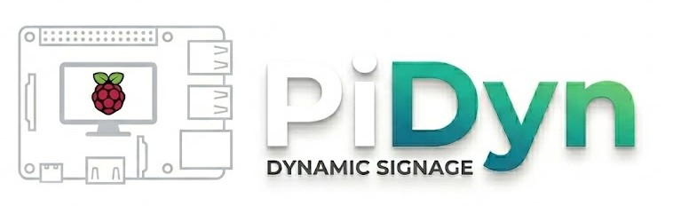
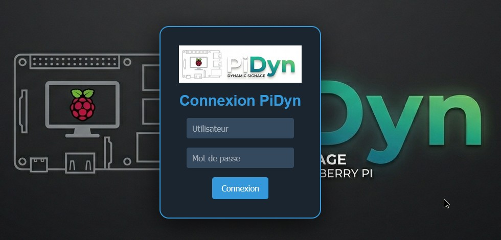
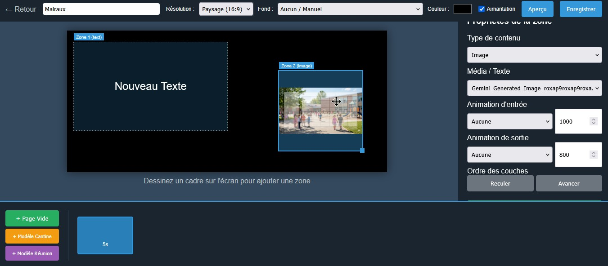
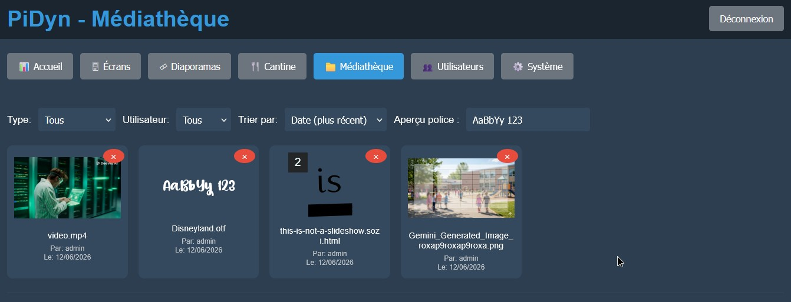

# PiDyn - Dynamic Digital Signage System

<p align="center">
  
</p>
## English

> [!WARNING]
> This project has just been launched and is currently a **Proof of Concept (POC)**. It is **not** intended for production use at this stage.

### Preview
<p align="center">
  <br>
  <em>Secure Login Interface</em><br><br>
  <br>
  <em>Multi-zone Slideshow Editor</em><br><br>
  <br>
  <em>Centralized Media Library Management</em>
</p>

PiDyn is a comprehensive digital signage solution designed to provide centralized management of content for Raspberry Pi-based display units. It consists of a Node.js server for administration and content delivery, and a client-side application for Raspberry Pi devices that handles display and real-time synchronization.

## Features
### Server-side (Node.js)
*   **Web-based Administration Panel:** A user-friendly interface (`admin.html`, `editor.html`, `users.html`, `player.html`) for managing all aspects of the digital signage system.
*   **Real-time Flash Messaging:** Send instant alerts (info, warning, danger) to specific screens or all devices simultaneously.
*   **Advanced Analytics:** Track media playback frequency and duration with visual charts (Chart.js) and a "Top 50" leaderboard.
*   **Remote Device Control:** Take screenshots, force synchronization, clear local cache, or restart the client service directly from the dashboard.
*   **Group Management:** Organize players by location or category to assign content or trigger actions at scale.
*   **User Management:** Create and manage users with different roles (admin, editor, author) for granular access control. Passwords are securely hashed using bcrypt.
*   **Playlist Management:** Create, edit, and delete dynamic playlists composed of various media types (images, videos).
*   **Media Management:** Upload and organize media files (images, videos) to be used in playlists.
*   **Player Management:** Register, approve, and assign specific playlists to individual Raspberry Pi display units. Monitor their status (last seen).
*   **Content Scheduling:** Implement time-based scheduling to automatically switch playlists on players at predefined times.
*   **Real-time Updates:** Utilizes Socket.IO to push instant playlist changes and updates to connected Raspberry Pi clients.
*   **Maintenance & Backup:** Built-in ZIP backup and restoration tool for both the SQLite database and media files.
*   **Data Persistence:** Stores all configuration, user data, playlists, and schedules in a SQLite database (`pidyn.sqlite`).
*   **Authentication:** API key-based authentication for Raspberry Pi clients and token-based authentication for the administration panel.
*   **System Logs:** Automated timestamps on all server and client logs for easier troubleshooting.
*   **Standalone Executable:** Capability to package the server as a single `.exe` (Windows) or binary (Linux) using `pkg` for easier distribution.
*   **PPTX Import (Planned):** Suggested structure for importing PowerPoint presentations and converting slides to images for playlists.
### Client-side (Raspberry Pi)
*   **Automated Setup:** Improved `bash` script (`setup_pi.sh`) compatible with Debian 12 (Bookworm) and 13 (Trixie), handling automated installation of Node.js, Chromium, and X11.
*   **Kiosk Mode:** Advanced Chromium configuration (auto-login, cursor hiding with `unclutter`, hardware acceleration) for a professional full-screen experience.
*   **Automatic Boot:** Automatic configuration of LightDM and Openbox to start the player immediately upon power-up.
*   **Systemd Service:** Sets up `sync-engine.js` as a systemd service for automatic startup and background operation.
*   **Real-time Playlist Synchronization:** The `sync-engine.js` client connects to the server via Socket.IO to receive playlist updates.
*   **Enhanced Monitoring:** Reports network status (IP, MAC), WiFi details (SSID, Signal Quality), and playback progress to the CMS.
*   **Media Synchronization:** Automatically downloads and caches media files locally from the server, ensuring smooth playback and offline capability.
*   **Configurable:** Reads device-specific configuration (`DEVICE_ID`, `SERVER_URL`, `API_KEY`) from `/boot/setup.txt`.

## Technologies Used
*   **Backend:** Node.js, Express.js, Socket.IO, fs-extra, multer, bcrypt, axios
*   **Frontend:** HTML, CSS, JavaScript (for admin UI)
*   **Client (Raspberry Pi):** Node.js, Socket.IO Client, axios, Chromium, X11, LightDM, Openbox, Systemd, Bash
*   **Database:** SQLite for robust data persistence

## Getting Started
### Server Setup
1.  **Prerequisites:** Ensure Node.js and npm are installed on your server.
2.  **Option A: Standard Installation:**
   ```bash
   git clone https://github.com/gotenash/PiDyn.git
   cd PiDyn/client # Assuming server.js is in the client directory for this context
   ```
3.  **Install dependencies:**
   ```bash
   npm install
   ```
4.  **Start the server:**
   ```bash
   node server.js
   ```
   The server will start on port `3000` (or `process.env.PORT`).

5.  **Option B: Standalone Executable (Windows/Linux):**
    Run the `build_exe.bat` script to create a standalone executable in the `dist/` folder. This version includes Node.js and doesn't require pre-installation on the target machine.

### Raspberry Pi Client Setup
1.  **Prepare SD Card:** Flash Raspberry Pi OS (Lite or Desktop, depending on your needs) onto an SD card.
2.  **Create `setup.txt`:**
    *   For **Bullseye** and older: Create the file in the `/boot/` partition.
    *   For **Bookworm/Trixie**: Create the file in the `/boot/firmware/` partition.
    
    Add the following content:
   ```
   DEVICE_ID=your-unique-device-id
   SERVER_URL=http://your-server-ip:3000
   API_KEY=ma_cle_secrete_123 # This should match the API_KEY in server.js
   ```
3.  **Copy Client Files:** Copy the entire `pidyn_client` directory (containing `sync-engine.js`, `player.html`, `media/`, etc.) to the `/boot/` partition of your SD card.
4.  **Run Setup Script:** Boot your Raspberry Pi. The `setup_pi.sh` script is designed to be run once to configure the system.
   ```bash
   sudo /boot/setup_pi.sh
   ```
   The script will update the system, install Node.js, Chromium, X11, copy application files, install Node.js dependencies, and set up systemd services for automatic startup. It will then reboot the system.

## Usage
1.  **Access Admin Panel:** Open a web browser and navigate to `http://your-server-ip:3000`.
2.  **Login:** Use the default credentials (e.g., `admin`/`123456`) to log in. **It is highly recommended to change default passwords immediately.**
3.  **Upload Media:** Go to the media section to upload your images and videos.
4.  **Create Playlists:** Design playlists by adding your uploaded media, setting durations, and other properties.
5.  **Manage Players:** Approve new Raspberry Pi clients that connect. Assign playlists to them manually or create schedules.
6.  **Schedule Content:** Define schedules to automatically display different playlists at specific times on your players.

## License
This project is licensed under the MIT License.

# PiDyn - Système d'Affichage Dynamique

<p align="center">
  
</p>
## Français

> [!WARNING]
> Ce projet vient d'être lancé et est actuellement un **Proof of Concept (POC)**. Il ne doit **pas** être utilisé en production pour le moment.

### Aperçu
<p align="center">
  <br>
  <em>Interface de connexion sécurisée</em><br><br>
  <br>
  <em>Éditeur de diaporamas multi-zones</em><br><br>
  <br>
  <em>Gestion centralisée de la médiathèque</em>
</p>

PiDyn est une solution complète d'affichage dynamique conçue pour offrir une gestion centralisée du contenu pour les unités d'affichage basées sur Raspberry Pi. Il se compose d'un serveur Node.js pour l'administration et la diffusion de contenu, et d'une application côté client pour les appareils Raspberry Pi qui gère l'affichage et la synchronisation en temps réel.

## Fonctionnalités
### Côté Serveur (Node.js)
*   **Panneau d'Administration Web:** Une interface conviviale (`admin.html`, `editor.html`, `users.html`, `player.html`) pour gérer tous les aspects du système d'affichage dynamique.
*   **Messages Flash en Temps Réel :** Envoyez des alertes instantanées (info, attention, danger) à des écrans spécifiques ou à tout le parc.
*   **Analyses et Statistiques :** Suivez la fréquence et la durée de diffusion des médias avec des graphiques visuels et un classement "Top 50".
*   **Contrôle à Distance :** Prenez des captures d'écran, forcez la synchronisation, videz le cache ou redémarrez le service client à distance.
*   **Gestion des Groupes :** Organisez les afficheurs par emplacement ou catégorie pour des actions groupées.
*   **Gestion des Utilisateurs:** Créez et gérez des utilisateurs avec différents rôles (administrateur, éditeur, auteur) pour un contrôle d'accès granulaire. Les mots de passe sont hachés de manière sécurisée à l'aide de bcrypt.
*   **Gestion des Playlists:** Créez, modifiez et supprimez des playlists dynamiques composées de divers types de médias (images, vidéos).
*   **Gestion des Médias:** Téléchargez et organisez les fichiers multimédias (images, vidéos) à utiliser dans les playlists.
*   **Gestion des Lecteurs (Players):** Enregistrez, approuvez et attribuez des playlists spécifiques à des unités d'affichage Raspberry Pi individuelles. Surveillez leur statut (dernière connexion).
*   **Planification de Contenu:** Mettez en œuvre une planification basée sur le temps pour changer automatiquement les playlists sur les lecteurs à des heures prédéfinies.
*   **Mises à Jour en Temps Réel:** Utilise Socket.IO pour envoyer instantanément les modifications et les mises à jour des playlists aux clients Raspberry Pi connectés.
*   **Maintenance et Sauvegarde :** Outil intégré de sauvegarde et restauration au format ZIP (Base de données + Médias).
*   **Persistance des Données:** Stocke toutes les configurations, les données utilisateur, les playlists et les planifications dans une base de données SQLite (`pidyn.sqlite`).
*   **Authentification:** Authentification par clé API pour les clients Raspberry Pi et authentification par jeton pour le panneau d'administration.
*   **Logs Système :** Horodatage automatique des logs serveur et client pour faciliter le dépannage.
*   **Exécutable Autonome :** Possibilité de packager le serveur en un seul fichier `.exe` (Windows) ou binaire (Linux) via `pkg` pour une distribution simplifiée.
*   **Import PPTX (Prévu):** Structure suggérée pour l'importation de présentations PowerPoint et la conversion des diapositives en images pour les playlists.
### Côté Client (Raspberry Pi)
*   **Installation Automatisée:** Script `setup_pi.sh` amélioré et compatible Debian 12 (Bookworm) et 13 (Trixie), gérant l'installation auto de Node.js, Chromium et X11.
*   **Mode Kiosque :** Configuration avancée de Chromium (auto-login, masquage souris via `unclutter`, accélération matérielle) pour un rendu plein écran professionnel.
*   **Démarrage Automatique :** Configuration automatique de LightDM et Openbox pour lancer le lecteur dès la mise sous tension.
*   **Service Systemd:** Configure `sync-engine.js` en tant que service systemd pour un démarrage automatique et un fonctionnement en arrière-plan.
*   **Synchronisation des Playlists en Temps Réel:** Le client `sync-engine.js` se connecte au serveur via Socket.IO pour recevoir les mises à jour des playlists.
*   **Surveillance Améliorée :** Remontée des infos réseau (IP, MAC), du WiFi (SSID, Signal) et de la progression des téléchargements.
*   **Synchronisation des Médias:** Télécharge et met en cache automatiquement les fichiers multimédias localement depuis le serveur, assurant une lecture fluide et une capacité hors ligne.
*   **Configurable:** Lit la configuration spécifique à l'appareil (`DEVICE_ID`, `SERVER_URL`, `API_KEY`) à partir de `/boot/setup.txt`.

## Technologies Utilisées
*   **Backend:** Node.js, Express.js, Socket.IO, fs-extra, multer, bcrypt, axios
*   **Frontend:** HTML, CSS, JavaScript (pour l'interface d'administration)
*   **Client (Raspberry Pi):** Node.js, Client Socket.IO, axios, Chromium, X11, LightDM, Openbox, Systemd, Bash
*   **Base de Données:** SQLite pour une persistance robuste des données

## Démarrage Rapide
### Configuration du Serveur
1.  **Prérequis:** Assurez-vous que Node.js et npm sont installés sur votre serveur.
2.  **Option A : Installation Standard :**
   ```bash
   git clone https://github.com/gotenash/PiDyn.git
   cd PiDyn/client # En supposant que server.js se trouve dans le répertoire client pour ce contexte
   ```
3.  **Installer les dépendances:**
   ```bash
   npm install
   ```
4.  **Démarrer le serveur:**
   ```bash
   node server.js
   ```
   Le serveur démarrera sur le port `3000` (ou `process.env.PORT`).

5.  **Option B : Exécutable autonome (Windows/Linux) :**
    Lancez le script `build_exe.bat` pour créer un exécutable autonome dans le dossier `dist/`. Cette version embarque Node.js et ne nécessite aucune installation préalable sur la machine cible.

### Configuration du Client Raspberry Pi
1.  **Préparer la Carte SD:** Flashez Raspberry Pi OS (Lite ou Desktop, selon vos besoins) sur une carte SD.
2.  **Créer `setup.txt` :**
    *   Pour **Bullseye** et versions antérieures : Créez le fichier dans la partition `/boot/`.
    *   Pour **Bookworm/Trixie** : Créez le fichier dans la partition `/boot/firmware/`.
    
    Ajoutez le contenu suivant :
   ```
   DEVICE_ID=votre-identifiant-unique-d-appareil
   SERVER_URL=http://votre-ip-serveur:3000
   API_KEY=ma_cle_secrete_123 # Cela doit correspondre à l'API_KEY dans server.js
   ```
3.  **Copier les Fichiers Client:** Copiez l'intégralité du répertoire `pidyn_client` (contenant `sync-engine.js`, `player.html`, `media/`, etc.) sur la partition `/boot/` de votre carte SD.
4.  **Exécuter le Script d'Installation:** Démarrez votre Raspberry Pi. Le script `setup_pi.sh` est conçu pour être exécuté une seule fois afin de configurer le système.
   ```bash
   sudo /boot/setup_pi.sh
   ```
   Le script mettra à jour le système, installera Node.js, Chromium, X11, copiera les fichiers de l'application, installera les dépendances Node.js et configurera les services systemd pour un démarrage automatique. Il redémarrera ensuite le système.

## Utilisation
1.  **Accéder au Panneau d'Administration:** Ouvrez un navigateur web et accédez à `http://votre-ip-serveur:3000`.
2.  **Connexion:** Utilisez les identifiants par défaut (par exemple, `admin`/`123456`) pour vous connecter. **Il est fortement recommandé de changer les mots de passe par défaut immédiatement.**
3.  **Télécharger des Médias:** Accédez à la section des médias pour télécharger vos images et vidéos.
4.  **Créer des Playlists:** Concevez des playlists en ajoutant vos médias téléchargés, en définissant les durées et d'autres propriétés.
5.  **Gérer les Lecteurs:** Approuvez les nouveaux clients Raspberry Pi qui se connectent. Attribuez-leur des playlists manuellement ou créez des planifications.
6.  **Planifier du Contenu:** Définissez des planifications pour afficher automatiquement différentes playlists à des moments spécifiques sur vos lecteurs.

## Licence
Ce projet est sous licence MIT.
